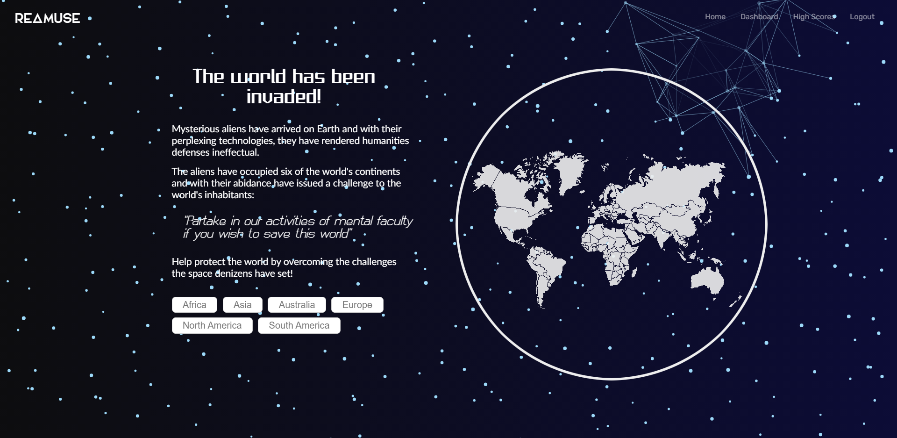
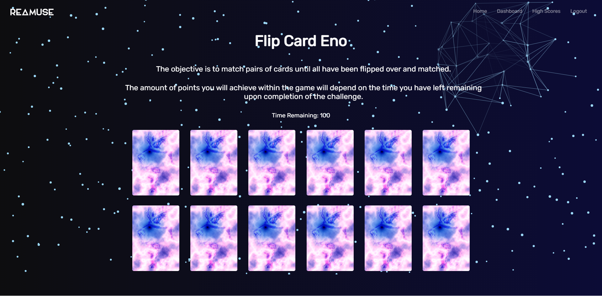

# Reamuse

[](https://opensource.org/licenses/MIT)
[](https://developer.mozilla.org/en-US/docs/Web/Progressive_web_apps)
[](https://webpack.js.org/)
[](https://reactjs.org/)
[](https://redux.js.org/)
[](https://www.apollographql.com/)
[](https://www.apollographql.com/)
[](https://nodejs.org/en/docs/)
[](https://expressjs.com/)
[](https://www.mongodb.com/)
[](https://mongoosejs.com/)
[](https://styled-components.com/)
[](https://www.javascript.com/)
[](https://developer.mozilla.org/en-US/docs/Glossary/HTML5)
[](https://developer.mozilla.org/en-US/docs/Web/CSS)
[](https://www.npmjs.com/package/jsonwebtoken)
[](https://www.npmjs.com/package/gsap)

## Description

An application that allows the user to play memory and cognitive related games wrapped within an amusing narrative experience.

The app was built using the MERN stack with a React and Redux front end, MongoDB database, and Node.js/Express.js server and API.

## 📖Table of Contents
1. [Installation](#installation)
2. [Usage](#usage)
3. [Assets](#assets)
4. [Technologies](#technologies)
5. [License](#license)
6. [Contributing](#contributing)
7. [Tests](#tests)
8. [Questions](#questions)

## Installation
No installation is necessary to use the website.

If you wish to install the repository on your local machine, please follow the below steps:
1. To install this application clone it through GitHub using the following code in the terminal: 
    ``` 
    git clone https://github.com/TrushilBudhia/Reamuse.git
    ```
2. To add the dependencies to the application, navigate to the root directory for the application and run:
    ```js
    npm install
    ```

## Usage
An account can be creted with the signup button and once logged in, the user can navigate to the dashboard and select the region they wish to challenge. Each active region leads to a game to challenge. 

## Assets
Live demo of the application hosted on Heroku: [Reamuse](https://reamuse.herokuapp.com/)

The following images shows the functionality of the application: 





## Technologies
- [React](https://reactjs.org/)
- [Redux](https://redux.js.org/)
- [React Redux](https://react-redux.js.org/)
- [Redux Thunk](https://www.npmjs.com/package/redux-thunk)
- [Webpack](https://webpack.js.org/)
- [Apollo](https://www.apollographql.com/)
- [GraphQL](https://www.apollographql.com/)
- [Node.js](https://nodejs.org/en/docs/)
- [Express](https://expressjs.com/)
- [MongoDB](https://www.mongodb.com/)
- [Mongoose](https://mongoosejs.com/)
- [Heroku](https://www.heroku.com/)
- [Styled-Components](https://styled-components.com/)
- [Green Sock Animation Platform](https://www.npmjs.com/package/gsap)
- [bcrypt](https://www.npmjs.com/package/bcrypt)
- [React Icons](https://react-icons.github.io/react-icons/)
- [Adobe Photoshop](https://www.adobe.com/au/products/photoshop.html)
- JavaScript
- HTML5
- CSS3

## Planning:
- [Press Release](https://docs.google.com/document/d/1Rk1Vg9bSStk0ZIkwXMS2bSKIGsuYLbc2/edit?usp=sharing&ouid=102759392178489523884&rtpof=true&sd=true)
- [User Story Map](https://drive.google.com/file/d/1_YZGxgU9yf7jjZlOCQzbYXwnxwtUzOl5/view?usp=sharing)
- [Presentation](https://docs.google.com/presentation/d/1_T9ApZt909GunGRKBthmDyw1E8L-_h85j8yWbtGdIUI/edit?usp=sharing)

## License
Copyright © 2021 [Trushil](https://github.com/TrushilBudhia)

This project is [MIT](./LICENSE) licensed

## Contributing
Contributions, issues and feature requests are welcome.

Feel free to check the [issues page](https://github.com/TrushilBudhia/Reamuse/issues) if you want to contribute.

## Tests
There are no tests currently for this application.

## Questions
For any questions, please contact the author:

- Github: [@Trushil](https://github.com/TrushilBudhia)
- Email: trushil.budhia@gmail.com


